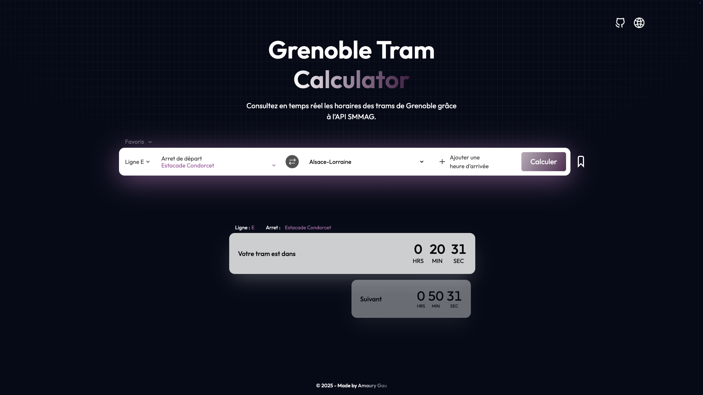
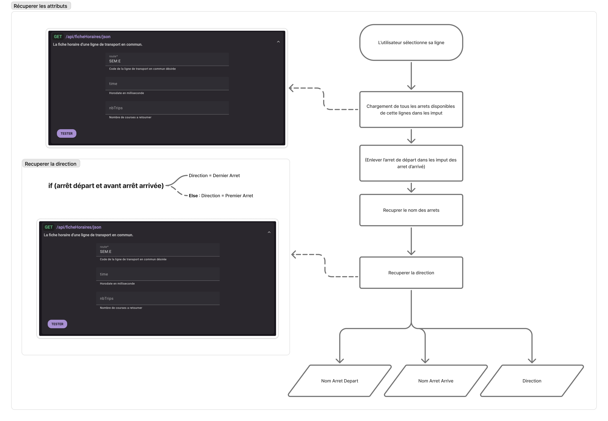
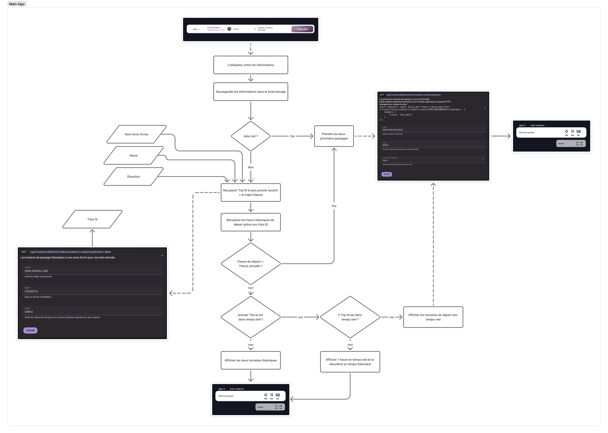

# Grenoble Tram Calculator

[Grenoble Tram Calculator](https://amstagu.github.io/r4a10-tp-api-2025-gaua/) à été crée en solo à titre pédagogique dans le cadre d'introduction à l'utilisation d'APIs. Il répond à l’un de mes besoins : obtenir un décompte du temps avant l’arrivée du tram que je dois prendre, en fonction de mon heure d’arrivée souhaitée.

## Sommaire

- [Présentation](#présentation)
- [Fonctionnement des algorithmes](#algorithmes)
- [Architecture du projet](#architecture)

## Présentation

L’utilisateur sélectionne sa ligne, son arrêt de départ, son arrêt d’arrivée ainsi que l’heure à laquelle il souhaite arriver (facultatif). L’application calcule alors automatiquement la direction et les horaires des prochains passages, tout en affichant un compte à rebours jusqu’au prochain tramway.



L'API utilisée pour ce projet est [l'API SMMAG](https://data.mobilites-m.fr/donnees) qui recueille des données statiques et dynamiques sur les informations des transports en commun.

## Algorithmes

Ce projet repose principalement sur trois algorithmes qui assurent son bon fonctionnement :

### 1. Détermination de la direction

L’algorithme détermine la direction du tramway à partir des arrêts de départ et d’arrivée choisis par l’utilisateur :


### 2. Calcul des horaires de départ

Deux algorithmes supplémentaires permettent de calculer les horaires de départ des prochains tramways à prendre, en fonction de l’horaire d’arrivée souhaité :


## Architecture

Le projet utilise une architecture MVC (Model - View - Controller)

```text
├── index.html
├── js
│   ├── main.js                <-- Controller : gère les interactions entre la vue et les modèles
│   ├── modelCountdown.js      <-- Model : gère le compte à rebours
│   ├── modelSearch.js         <-- Model : gère la récupération et le traitement des données horaires
│   └── view.js                <-- View : contient tous les sélecteurs DOM et permet de mettre à jour l'interface
├── src
│   ├── Favicon.png
│   ├── Favoris.svg
│   ├── FavorisFill.svg
│   ├── changer.png
│   ├── chevron.svg
│   ├── github.png
│   ├── plus.svg
│   └── portfolio.png
└── tailwind.config.js
```
